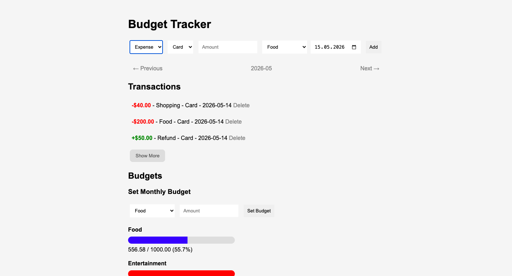
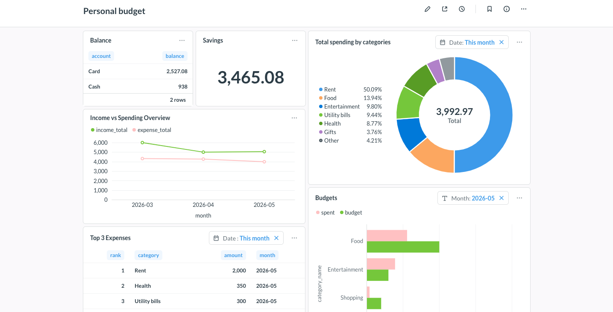

# Personal Finance Tracker & Analytics Dashboard

Personal finance management system featuring transaction tracking, monthly budgets, SQL analytics, and a Metabase dashboard.

## Overview

Managing personal finances effectively requires more than simply recording expenses. Understanding where money is spent, how spending patterns evolve over time, and whether financial goals are being met often requires a combination of data collection, analysis, and visualization.

This project was built to solve that problem by providing:
- A [web application](budget-app/) for recording income, expenses, and monthly budgets
- A structured [MySQL database](database/) for reliable financial data storage
- SQL-powered analytics for financial reporting
- A [Metabase dashboard](metabase/) for interactive data visualization and trend analysis

The system enables users to track spending, monitor budget performance, identify high-cost categories, and make data-driven decisions to improve savings and reduce unnecessary expenses.

## Key Features

### Web Application (budget-app)

#### Monthly Budget Tracking
- Create and manage monthly budgets
- Compare actual spending against budget targets
- Visual budget progress bars - povide immediate visibility into whether spending remains within budget limits

#### Local-First Data Storage
- Financial records stored in a MySQL database
- No dependency on external finance platforms
- Full ownership and control of financial data

### Analytics Dashboard (Metabase)

#### Spending by Category
- Donut chart visualization with month-based filtering
- Quickly identify highest-spending categories

#### Top Expenses
- Monthly expense ranking table
- Highlights major spending events

#### Income vs Spending Trends
- Multi-month line chart
- Visual comparison of income and expenses over time
- Supports long-term financial trend analysis

#### Budget Performance
- Filterable monthly budget visualization
- Easy identification of overspending periods

#### Financial Summary Metrics
- Card balance overview
- Cash balance overview
- Savings tracking

## Screenshots

### Web Application (budget-app)

### Analytics Dashboard (Metabase)

## Usage

### Add Transactions

Record income and expenses through the web interface.

### Set Monthly Budgets

Create monthly spending targets and monitor progress against them.

### Review Financial Performance

Navigate between months to analyze historical financial activity.

### Analyze Trends

Use the Metabase dashboard to:
- Monitor spending categories
- Compare income and expenses
- Track savings growth
- Review budget adherence